# Results Showcase: Reliability-Aware Wildlife Detection

A visual summary of the project's key results: the data, the trained models, the
accuracy numbers, and the end-to-end pipeline. All figures are generated by the
notebooks and saved in `reports/` (and `notebook4_outputs/`).

> Note on how this was produced: the YOLO detector and the two classifiers were trained
> on a cloud GPU (Azure) as background scripts (the laptop has no GPU), and the notebooks
> load the saved weights to evaluate them. One side effect: there are no per-epoch
> training curves for the classifiers (the scripts didn't log them), only the
> confusion matrices and final metrics. The YOLO training curves below are real (logged
> automatically during training).

---

## Headline result

We trained the detector, found a few problems in the first run, fixed them, and trained
again. Every detection metric went up (test set):

| Metric | First run | After fixes |
|--------|-----------|-------------|
| mAP@0.5 | 0.185 | **0.217** |
| mAP@0.5:0.95 | 0.063 | **0.080** |
| Precision | 0.308 | **0.512** |
| Recall | 0.204 | **0.221** |

What we fixed between the two runs:
- The model trained at 1280 but was being evaluated at 640, where the tiny animals
  vanish, so we evaluate at the same 1280 it trained on.
- The crops were saved as JPEG (which blurs them, bad when we measure blur), switched
  to lossless PNG.
- "no-animal" was a detection class, but there is nothing to put a box around, so we
  dropped it and kept the 7 real species.

We also tested the resolution directly by training a version at 640. It scored lower than
the original run, which confirmed the animals are too small for the lower resolution, so
everything stayed at 1280.

---

## 1. The data (EDA)

After cleaning: 17,630 images, 55,386 annotations, 190 flights, 7 species.

**Week 1: cleaned dataset summary**
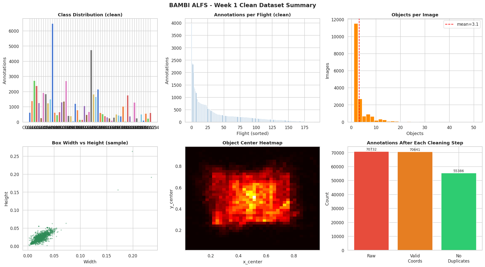

**Bounding-box statistics (animals are very small in the frame)**
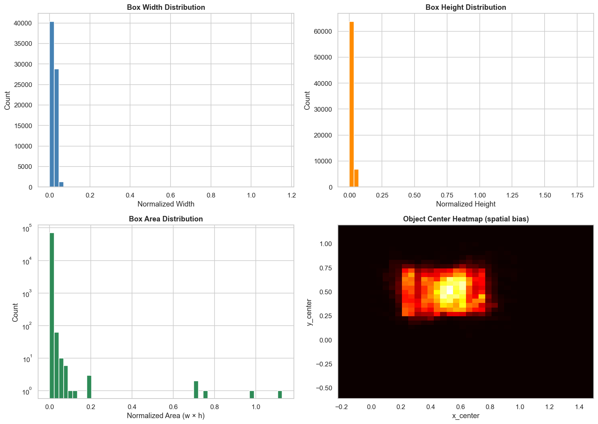

**Week 2: split, crops, and reliability labels**
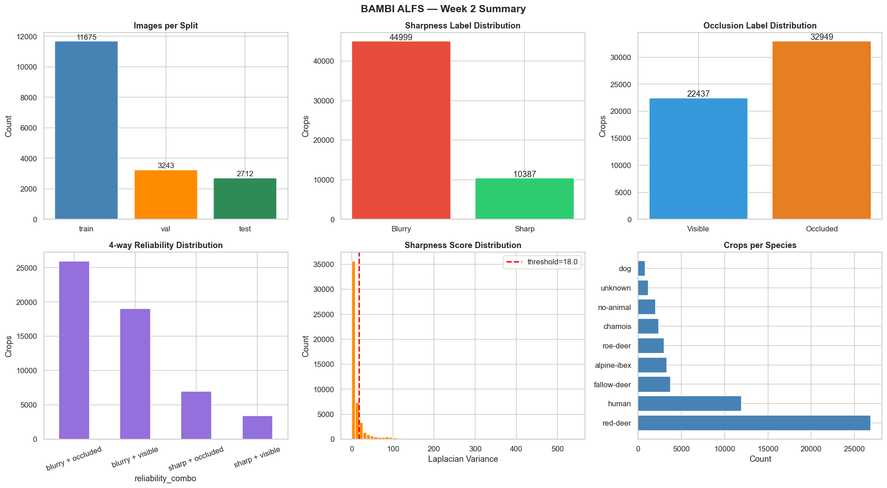

---

## 2. Detection (YOLOv11)

**Training curves.** YOLOv11s fine-tuned at 1280 with early stopping. The loss falls and
the validation mAP climbs over training; the best model landed at epoch 30, and training
stopped at epoch 40 once ten more epochs brought no improvement.
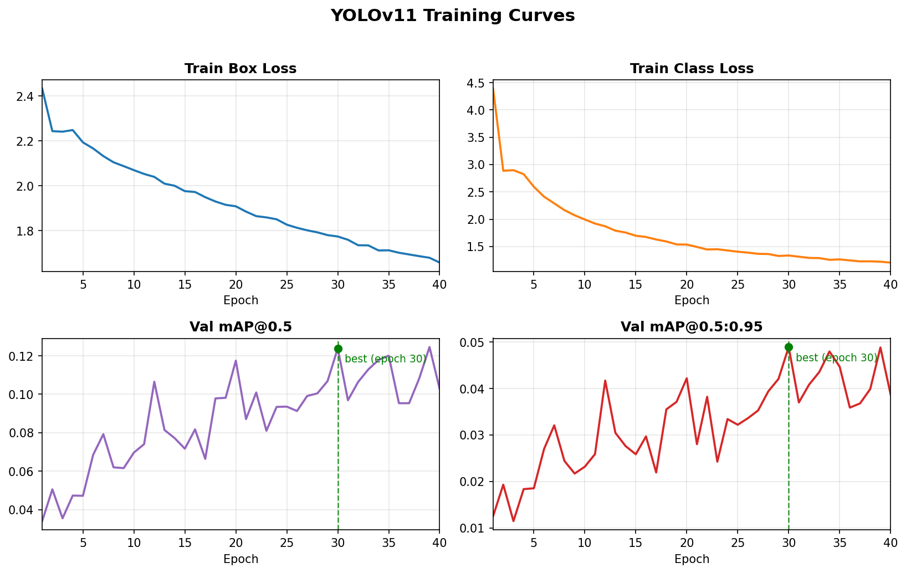

**Per-class accuracy (test set, mAP@0.5)**

| Species | mAP@0.5 |
|---------|---------|
| red-deer | 0.427 |
| alpine-ibex | 0.317 |
| fallow-deer | 0.275 |
| human | 0.227 |
| roe-deer | 0.181 |
| dog | 0.063 |
| chamois | 0.030 |

red-deer (the most common class) is detected best; the rarest species are hardest,
reflecting the class imbalance in the dataset.

---

## 3. Sharpness classifier

Predicts whether a detected animal is sharp or blurry. Test-set results:

| Metric | Value |
|--------|-------|
| F1 (macro) | **0.957** |
| ROC-AUC | 0.993 |

**Confusion matrix**
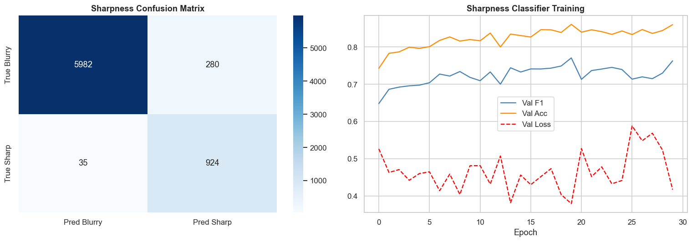

**Label audit.** Top row should look sharp, bottom row blurry (confirms the
automatic Laplacian labels match human perception):
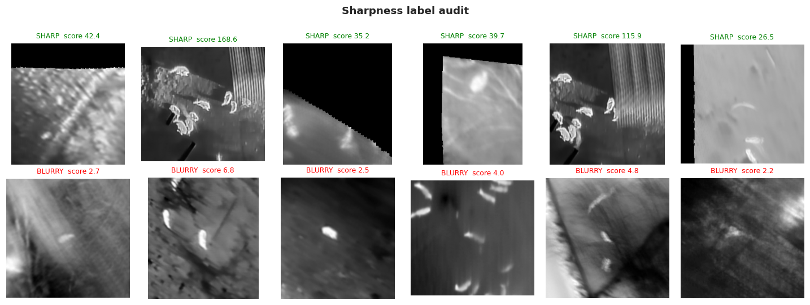

---

## 4. Occlusion classifier

Predicts whether a detected animal is visible or occluded. Test-set results:

| Metric | Value |
|--------|-------|
| F1 (macro) | 0.616 |
| ROC-AUC | 0.670 |

**Confusion matrix**
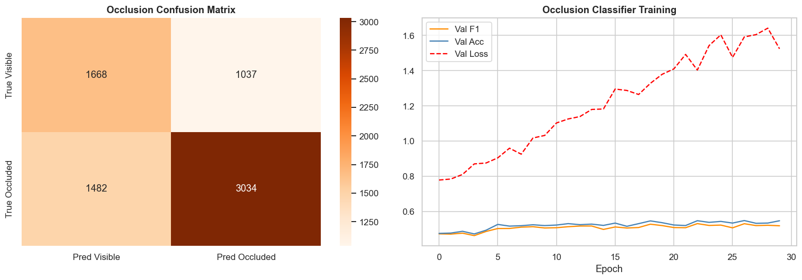

---

## 5. Does reliability predict detection difficulty?

We measure detection performance separately for each of the four reliability groups.
Detection of sharp animals is clearly better than blurry ones, which supports
the idea that the reliability labels capture real detection difficulty:

| Group | Detection F1 | Images |
|-------|--------------|--------|
| sharp + occluded | 0.823 | 168 |
| blurry + visible | 0.651 | 973 |
| blurry + occluded | 0.542 | 1907 |
| sharp + visible | 0.411 | 66 (small sample) |

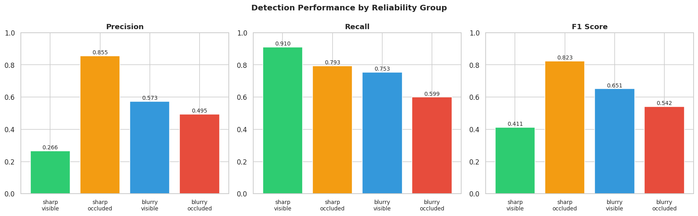

We also checked whether YOLO's own confidence score already predicts reliability
(if it did, the classifiers would add no value):

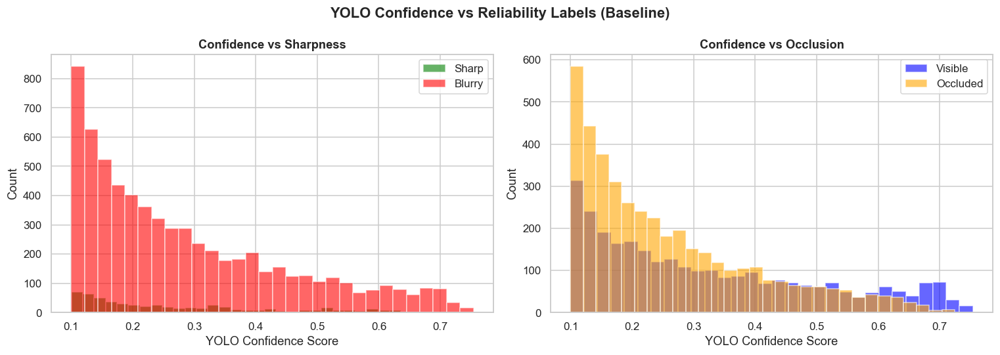

---

## 6. End-to-end pipeline

The deliverable promised in the proposal: a raw image goes in, and each detected
animal comes out tagged with a reliability verdict (green = reliable,
orange = caution, red = unreliable), based on its predicted sharpness and occlusion.

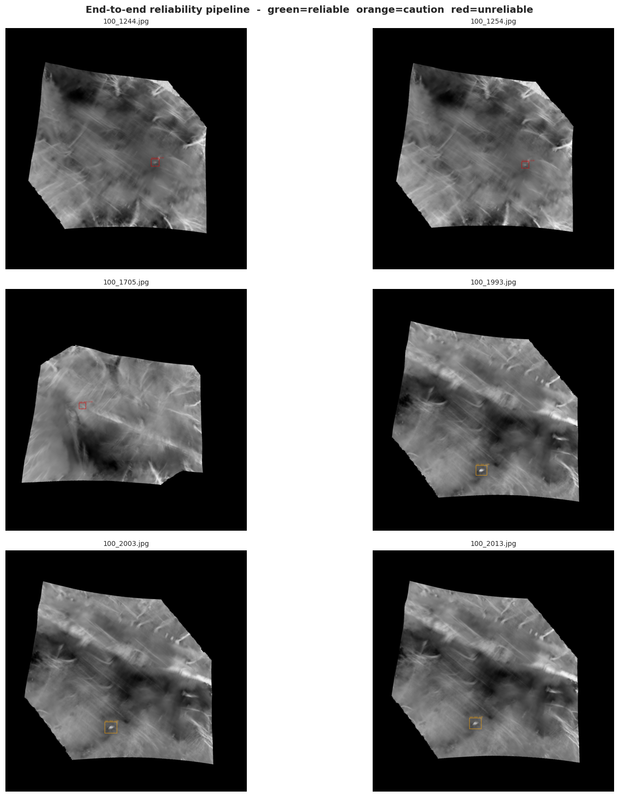

---

## 7. Manual sharpness check (Notebook 4)

As an independent sanity check, a classifier was trained on 100 hand-labelled images
(50 clear, 50 blurry). It reached F1 = 0.83 on the held-out images.

The comparison is the interesting part: the auto-labelled classifier scores 0.96 vs
the manual classifier's 0.83. That doesn't mean the auto one is "better". It scores
higher mainly because it's learning to reproduce the same Laplacian rule that generated
its labels. The manual classifier, trained on real human judgments, is the more honest
measure of how hard sharpness actually is to predict.

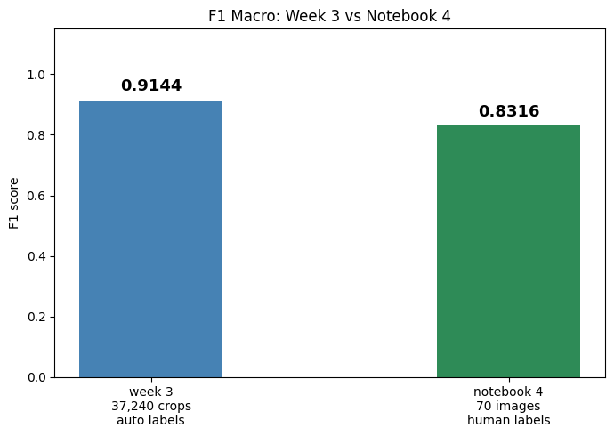
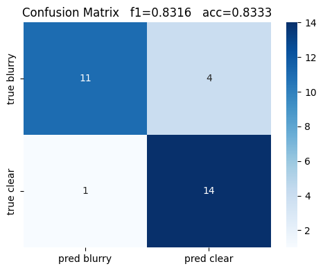
